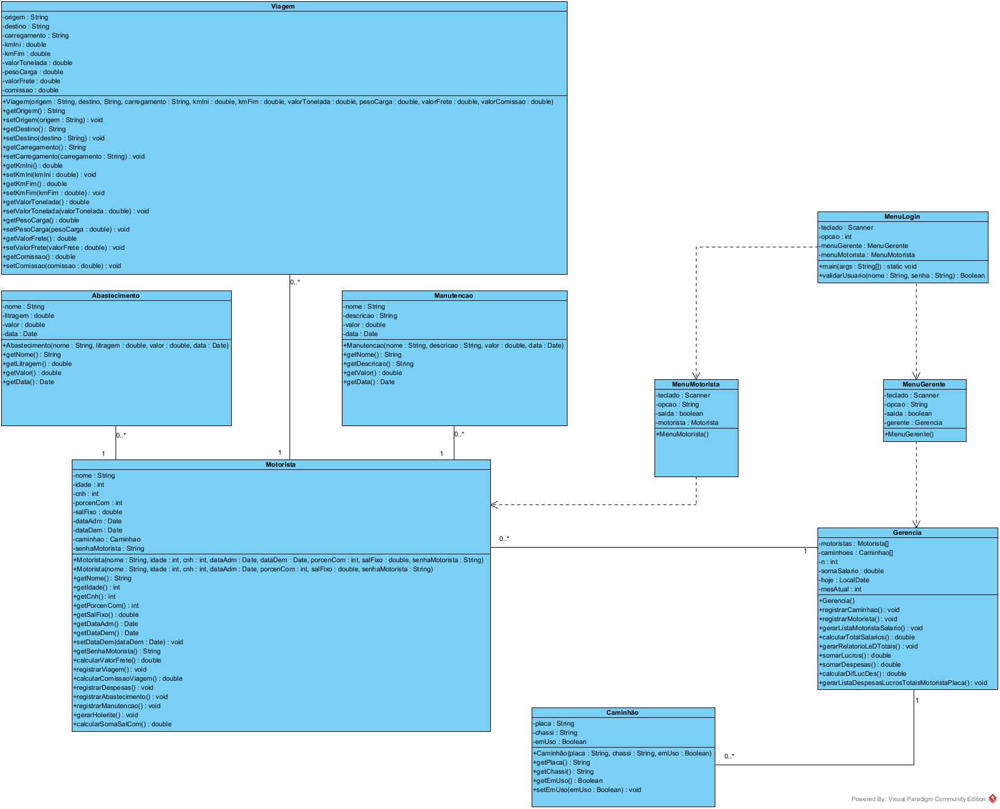

# M & M Transportes

## Sobre
Trabalho desenvolvido na disciplina de Análise de Projetos e Sistemas do curso de Engenharia de Computação na Universidade Técnológica Federal do Paraná. 

O presente trabalho se resumiu em fazer toda a <b> Especificção de Requisitos de Software </b>, desenvolvendo desde o escopo, requisitos funcionais e não funionais, digramas de caso de uso, sequência e de classes até a implementação em uma liguagem orientada a objetos.

### Ferramentas e Tecnologias:
* Para a construção dos diagramas foi utilizada a licença acadêmica do software <b> Visual Paradigm Community Edition </b>
* Para a implementção foi escolhida a linguagem <b> Java - versão  11.0.20 </b>

## Escopo:
O aplicativo que está sendo projetado visa facilitar o acesso e preenchimento de dados de uma empresa de transportes, que antes utilizavam planilhas eletrônicas para fazer cálculos e guardar informações de funcionários, caminhões e fretes. Além de facilitar outras análises dessa grande quantidade de informações, como despesas e lucros de cada caminhão separadamente.

Essa transportadora precisa lidar com vários motoristas e vários caminhões, portanto é necessário registrar o motorista [nome completo, idade, CNH, data de admissão, data de demissão, placa do caminhão com o qual trabalha (escolhida pelo sistema quando um caminhão não está em uso) ,porcentagem de comissão, salário fixo e uma senha de acesso] e registrar a placa de cada  caminhão da frota da transportadora e seu número do chassi, se um caminhão não estiver registrado ninguém pode usá-lo.

Será necessário que cada motorista tenha um login e senha para acessar a plataforma, onde deverá registrar os seguintes conteúdos referente a seu caminhão e cada uma das suas viagens ao longo do mês: nome da origem e destino da viagem, carregamento, quilometragem inicial, quilometragem final, valor do frete por tonelada, peso da carga, valor total do frete, comissão da viagem. Em cada comissão da viagem é calculada como (total do frete * porcentagem de comissão registrada no cadastro do funcionário) e o valor total do frete é calculado por peso * valor do frete por tonelada. Além de despesas gerais do veículo no mês como: manutenções e abastecimento. Se o motorista for demitido, ele não deverá conseguir acessar mais a plataforma.
Além disso, cada motorista, por meio de seu login, tem acesso a uma página para gerar seu holerite, em qualquer momento do mês, apresentando o seu salário do mês de acordo com a soma das comissões de suas viagens + salário fixo.

Deverá haver também um login separado para o chefe, que além de gerar o uma folha de pagamento dos funcionários, deve conseguir: criar e modificar os cadastros dos motoristas e caminhões, gerar despesas totais por mês de todos os veículos e de cada veículo por placa separadamente, gerar lucros totais por mês de todos os veículos e de cada veículo por placa. Além de gerar um relatório com todas as despesas e lucros totais, junto com o funcionário mais lucrativo e o menos lucrativo.

## Diagrama De Classes:

